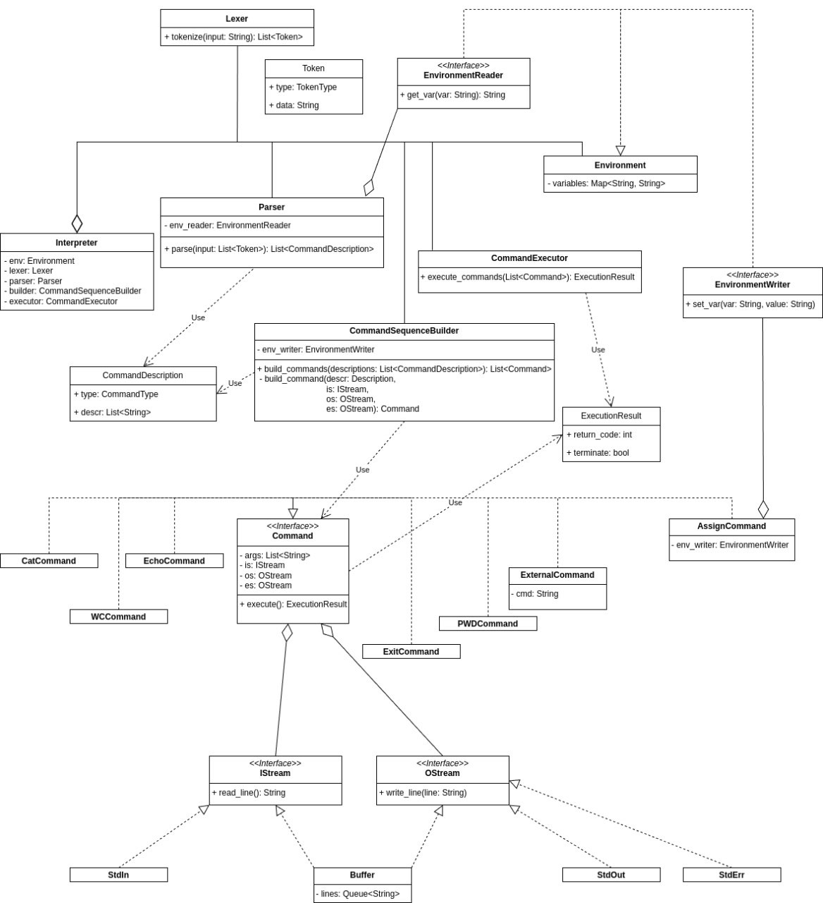

# Домашнее задание #1

## Структурная диаграмма

## Текстовое описание

### Устройство интерпретатора

Интерпретатор принимает на вход строковое описание команды (или последовательности команд, разделённых пайпами), которую нужно выполнить. Работает он по следующей схеме:

1. Вызвать [лексер](#устройство-лексера), который разобьёт исходную строку на токены.
2. Вызвать [парсер](#устройство-парсера), разобьёт последовательность токенов по пайпам и выполнит все необходимые подстановки переменных. Результат работы парсера &mdash; последовательность описаний команд, каждое описание &mdash; это тип команды и последовательность её аргументов (каждый аргумент &mdash; строчка с уже выполненными подстановками).
3. Вызвать [CommandSequenceBuilder](#устройство-commandsequencebuilder-а), который сначала создаст каждую команду по отдельности, а затем проставит командам правильные потоки ввода-вывода. Получили последовательность команд.
4. Вызвать [Executor](#устройство-executor-а), который выполняет последовательность команд по очереди и завершает работу либо встретив команду `exit`, либо выполнив все команды. 

### Устройство лексера
Лексер принимает на вход строковое описание команды и возвращает последовательность токенов. Каждый токен описывается своим типом и строковым представлением. Бывают следующие типы токенов:

- `variable`: строка, задающая название переменной
- `text`: строка, не являющаяся переменной
- `pipe`: пайп
- `delimeter`: разделитель между частями команды (в нашем случае это пробел, не заключённый в кавычки)
- `assign`: инструкция присвоения

Лексер работает следующим образом: обрабатываем строку слева направо, поддерживаем информацию о том, правда ли, что сейчас мы находимся внутри кавычек (и если да, то каких конкретно). Для обработки будем пользоваться следующими правилами:

- Встретив знак `$` вне кавычек или внутри двойных кавычек, заканчиваем текущий токен и помечаем следующий токен, как `variable`. 
- Встретив пробел, пайп или символ `=` вне кавычек, заканчиваем текущий токен и добавляем новый, соответствующий встреченному символу.
- Встретив кавычки, обновляем информацию о том, внутри каких кавычек мы сейчас находимся.
- Встретив любой другой символ, добавляем его к текстовому описанию текущего токена.

### Устройство парсера
Парсер принимает на вход последовательность токенов и возвращает описание каждой команды. Обработка токенов происходит следующим образом: мы поддерживаем текущий аргумент для текущей команды.

- Встретив токен `pipe`, мы понимаем, что текущий аргумент и текущая команда закончены.
- Встретив токен `delimeter`, мы понимаем, что текущий аргумент закончен.
- Встретив токен `variable`, мы узнаём значение переменной по её названию (для этого в парсере хранится соответствующее отображение) и приписываем в конец текущего аргумента.
- Встретив токен `text`, мы приписываем в конец текущего аргумента нашу строку.
- Встретив токен `assign`, мы заканчиваем текущий аргумент и запоминаем, что текущая команда является присвоением.

В итоге для каждой команды мы получили последовательность "сырых" аргументов. Тип команды и её реальные аргументы получаются из "сырых" следующим образом:
- Если мы встретили токен `assign`, то мы знаем тип команды, а также её реальные аргументы совпадают с "сырыми"
- Иначе название команды &mdash; это первый сырой токен. Проверяем, известна ли нам команда с таким названием. 
    - Если нет, то проставляем тип `external` и реальные аргументы совпадают с сырыми.
    - Если известна, то проставляем тип команды, реальные аргументы &mdash; это все "сырые" аргументы, кроме первого.

### Устройство CommandSequenceBuilder-а

Проходимся по описаниям команд, для каждой команды создаём инстанс класса, который её выполнит (все аргументы мы уже знаем). После этого проходимся по всем исполнителям команд и проставляем правильные потоки ввода-вывода (каждой следующей команде в качестве потока ввода проставляем поток вывода предыдущей команды). Каждый поток ввода-вывода &mdash; это либо один из стандартных потоков, либо буфер, являющийся последовательностью строк.

### Устройство Executor-а

Последовательно запускаем исполнителей команд, отслеживаем код возврата и правда ли, что после текущей команды нужно завершить работу. 

### Мысли про многопоточность

- В пайплайне могут быть команды, которые ничего не принимают на вход, и команды, которые ничего не отдают на выход. Тогда по командам первого вида мы можем безопасно поделить пайплайн слева, а по командам второго вида справа. Получили несколько почти независимых кусочков пайплайна &mdash; они не полностью независимы, потому что команды из разных частей могут работать с одинаковыми файлами. Построим граф зависимостей: проведём ребро из команды `A` в команду `B`, если `A` в пайплайне раньше `B` и они используют один и тот же файл. Тогда в каждый момент времени мы можем параллельно исполнять команды, имеющие входящую степень `0` в графе зависимостей.

- Каждая следующая команда пайплайна может использовать вывод предыдущей не целиком (например, команда `head`, стоящая после `cat` большого файла), в таком случае можно добавить механизм отмены выполнения команд. 